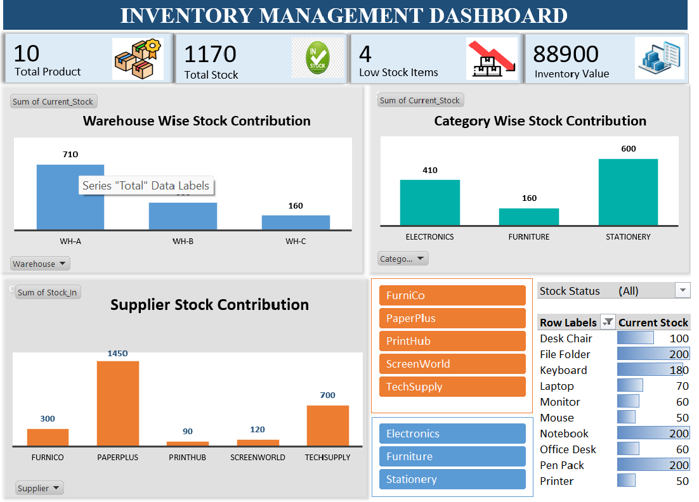

# 📦📊 Inventory Management Dashboard | Excel Project

🚀 Interactive Excel Dashboard for Inventory Tracking | Data Visualization | Business Insights | HR Analytics Perspective

---

## ✨ Key Highlights

* 📊 Real-time stock monitoring
* 📦 Warehouse-wise analysis
* 🏷️ Category & supplier insights
* ⚠️ Low stock identification
* 📈 KPI-driven dashboard

---

## 🛠️ Tools & Techniques

* Microsoft Excel
* Pivot Tables
* Data Visualization (Charts)
* Data Cleaning
* Slicers & Interactive Filters

---

## 📥 Download Project

👉 [Download Excel Dashboard](Inventory_Dashboard.xlsx)

---

## 📸 Dashboard Preview

### ✨ Main Dashboard

  

---

### 🔍 More Views

  
  
  

---

## 💡 Key Insights

* Enables efficient inventory tracking  
* Supports data-driven decision making  
* Identifies low stock items quickly  
* Enhances supplier performance visibility  
---

## 🌱 Learning & Growth

* Exploring HR analytics using Excel  
* Learning automation with VBA  
* Understanding real-time data integration  
---

## 👩‍💼 About Me

Hi, I’m **Saloni Agarwal**  

🎯 Aspiring HR Professional | BA.Voc HRM Student  

* 💡 Interested in recruitment, employee engagement, and workplace culture  
* 📊 Skilled in using Excel for data analysis and reporting  
* 🤝 Passionate about people management, communication, and team coordination  
* 📋 Basic understanding of HR processes like hiring, onboarding, and employee relations  
---

## 🔗 Connect with Me

* 💼 LinkedIn: https://linkedin.com/in/saloni-agarwal-7b9484291/
* 📧 Email: agarwalsaloni546@gmail.com

---

⭐ If you like this project, don’t forget to star the repo!

